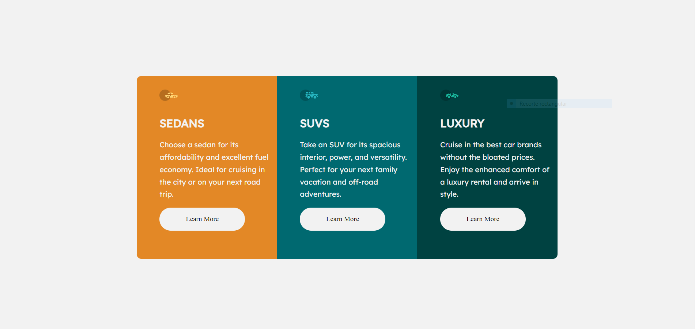

# Frontend Mentor - 3-column preview card component solution

Esta es una solución a la [Desafío de componentes de la tarjeta de vista previa de 3 columnas en Frontend Mentor] (https://www.frontendmentor.io/challenges/3column-preview-card-component-ph92ear2-).Frontend Mentor Los desafíos lo ayudan a mejorar sus habilidades de codificación al construir proyectos realistas.

## Tabla de contenido

- [Descripción general](#Descripción-general)
  - [El reto](#el-desafío)
  - [Captura de pantalla](#Captura-de-pantalla)
  - [Enlaces](#Enlaces)
- [Mi proceso](#mi-proceso)
  - [Construido con](#Construido-con)
  - [Qué aprendí](#Qué-aprendí)
  - [Desarrollo continuo](#Desarrollo-continuo)
  - [Recursos útiles](#Recursos-útiles)
- [Autor](#Autor)
## Descripción general

### EL Reto

Los usuarios deben ser capaces de:

- Ver el diseño óptimo para el sitio dependiendo del tamaño de la pantalla de su dispositivo

### Captura de pantalla

### Enlaces

- URL SOLUCION: [Solucion] (https://github.com/santi19999/column-preview-card-component-main)
- URL del sitio en vivo: [Sitio en Vivo] (https://column-preview-card-component-main-santi19999.netlify.app/)

## Mi proceso

### Construido con

- Markup html5 semántico
- Propiedades personalizadas CSS
- Mobile-First.
- CSS-Grid

### Que aprendí
**CSS GRID**

  - Aprendí a configurar los diferentes tamaños y cantidad de columnas como filas. Es la primera vez que uso grid y se me facilitaron muchas cosas.

### Desarrollo continuo

A medida que siga utilizando grid y lo termine de incorporar, lo podré fusionar con flexbox para facilitarme el proceso. Tanto como el posicionamiento, las dimenciones de los contenedores y su contenido.

### Recursos útiles

- [Mozilla Developer] (https://www.developer.mozilla.org) - Esta documentación tanto de HTML, CSS y JavaScript me sirvió para aclarar muchas de mis dudas.
- [Ejemplo de recursos 2] (https://www.css-tricks.com): este es una web increíble que me ayudó  a entender FlexBox. Lo recomiendo a cualquiera que siga aprendiendo este concepto.

## Autor

- Frontend Mentor - [@santi19999] (https://www.frontendmentor.io/profile/santi19999)
- Instagram - [@santiago.herrera9] (https://www.instagram.com/santiago.herrera9)

